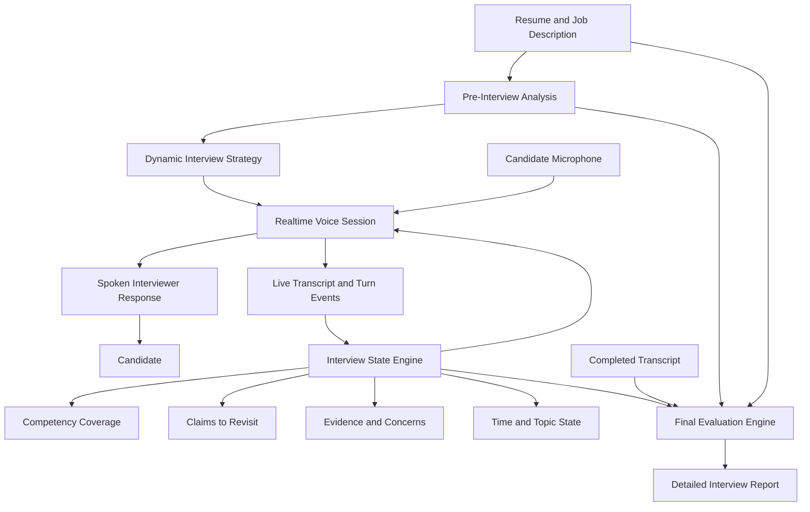

# AI Interviewer

A dynamic AI interview simulator that conducts realistic, personalized interviews based on a candidate’s resume and target job description.

Rather than presenting a predetermined list of questions, AI Interviewer behaves like a live interviewer. It listens to each response, decides what matters, asks targeted follow-up questions, changes direction when appropriate, and builds an evidence-based assessment of the candidate’s performance.

The goal is not simply to help candidates rehearse answers. The goal is to reproduce the pressure, uncertainty, pacing, and conversational dynamics of an actual interview as closely as possible.

## Overview

A user provides:

* Their resume
* A target job description
* The type of interview they want to practice
* The approximate interview duration

The application then:

1. Analyzes the role and candidate background.
2. Creates an internal interview strategy.
3. Conducts a live, voice-based interview.
4. Adapts each question to the conversation.
5. Probes vague or incomplete answers.
6. Tracks evidence across relevant competencies.
7. Generates a detailed post-interview assessment.

The interviewer does not reveal its internal evaluation during the session. It remains professional, selective, and realistic throughout the conversation.

## Core Features

* Resume-aware interview questions
* Job-description-aware interview strategy
* Live speech-to-speech conversation
* Natural interviewer voice
* Real-time interruption handling
* Automatic turn detection
* Dynamic follow-up questions
* Live interview transcript
* Competency tracking
* Interview progress tracking
* Question-by-question feedback
* Evidence-based final assessment
* Improved answer examples
* Text-only fallback
* Deterministic sample mode
* Local interview-session recovery

## A Dynamic Interview, Not a Question Generator

Many interview-practice tools generate a list of questions in advance and evaluate each answer independently.

AI Interviewer uses a stateful interview engine.

After every response, it determines whether to:

* Ask a deeper follow-up
* Challenge an unsupported claim
* Request a concrete example
* Clarify the candidate’s personal contribution
* Explore a relevant tradeoff
* Test a different competency
* Return to an earlier unresolved point
* Move to a new interview topic
* End the interview

The next question is influenced by:

* The candidate’s resume
* The target role
* Previous questions
* Previous answers
* Claims that remain unverified
* Competencies already covered
* Competencies still requiring evidence
* The remaining interview time
* The interviewer’s evolving view of the candidate

## Interview Types

The application can simulate:

* Recruiter screens
* Behavioral interviews
* Hiring-manager interviews
* Role-specific interviews
* Case-style interviews
* Executive interviews
* Mixed interviews

Each format changes the interviewer’s priorities, questioning style, pacing, and evaluation criteria.

## Realistic Interview Behavior

The interviewer should behave like a thoughtful human interviewer.

It should:

* Ask one clear question at a time
* Keep most questions concise
* Respond naturally to what the candidate says
* Avoid praising every answer
* Probe vague or rehearsed responses
* Challenge unsupported claims professionally
* Interrupt only when appropriate
* Allow brief pauses without immediately speaking
* Move forward when a line of questioning is exhausted
* Revisit unresolved claims later
* Adjust the interview based on remaining time
* Distinguish candidate evidence from model inference
* Avoid repeating questions unnecessarily
* Avoid revealing scores during the interview
* End the conversation naturally

The interviewer should not sound like a survey, tutor, coach, or generic chatbot while the interview is in progress.

## Adaptive Follow-Ups

The interviewer may ask a follow-up when an answer:

* Does not directly answer the question
* Remains too abstract
* Lacks a concrete example
* Does not establish personal ownership
* Gives no meaningful evidence of impact
* Avoids an important tradeoff
* Contains an unsupported claim
* Introduces a relevant new topic
* Conflicts with something said earlier
* Leaves a key competency unresolved

Examples include:

* “What specifically did you own?”
* “How did you measure the result?”
* “What made that decision difficult?”
* “What alternatives did you consider?”
* “How did your team respond?”
* “What did you learn from that?”
* “Can you give me a concrete example?”
* “Earlier, you mentioned X. How does that relate to Y?”

Follow-ups should emerge from the conversation rather than from a rigid checklist.

## How It Works

### 1. Candidate and Role Analysis

Before the interview, the application analyzes the supplied resume and job description.

It identifies:

* Core role responsibilities
* Required competencies
* Preferred qualifications
* Strong resume-to-role matches
* Potential experience gaps
* Ambiguous resume claims
* Relevant candidate experiences
* Topics that warrant deeper investigation
* Likely interviewer concerns
* An appropriate interview structure

This analysis remains hidden from the candidate until the interview is complete.

### 2. Interview Strategy

The application creates an internal interview plan.

The plan is not a fixed list of questions. It is a flexible strategy containing:

* Competencies to test
* Experiences to investigate
* Potential gaps to explore
* Suggested opening questions
* Possible follow-up directions
* Approximate time allocation
* Interview-type-specific priorities

The interviewer may depart from the plan when the conversation reveals a more useful direction.

### 3. Live Interview

The candidate speaks naturally with the interviewer.

The application uses a real-time voice session to:

* Detect when the candidate begins and stops speaking
* Transcribe the conversation
* Generate spoken interviewer responses
* Support natural interruptions
* Maintain low conversational latency
* Preserve interview state across turns

The interface also displays the transcript and interview progress.

### 4. Interview State Engine

A server-side state engine tracks:

* Questions already asked
* Candidate answers
* Interview time remaining
* Competencies tested
* Competencies requiring more evidence
* Claims worth revisiting
* Strong evidence
* Potential concerns
* Follow-up depth
* Topic coverage
* Contradictions or ambiguities

The voice model conducts the conversation, but the application—not the voice session alone—owns the durable interview state.

### 5. Post-Interview Evaluation

After the live interview ends, a separate reasoning step evaluates the full transcript against the resume and job description.

This separation allows the live interviewer to prioritize natural conversation while the evaluation system performs more deliberate and structured analysis.

## AI Architecture

AI Interviewer uses OpenAI across two complementary layers.

### Live Conversation Layer

The OpenAI Realtime API powers the spoken interview.

It handles:

* Streaming audio input
* Speech-to-speech responses
* Voice activity detection
* Turn-taking
* Interruptions
* Live transcription
* Conversational state
* Tool calls to the application server

### Deliberate Reasoning Layer

The OpenAI Responses API powers structured analysis.

It handles:

* Resume and job-description analysis
* Interview-plan generation
* Turn-level evidence extraction
* Competency updates
* Final evaluation
* Question-by-question feedback
* Improved answer generation

Structured outputs are validated before being accepted by the application.

## Architecture Diagram



## Why Speech-to-Speech?

The product is intended to simulate a live interview rather than a sequence of recorded answers.

Speech-to-speech enables:

* Lower conversational latency
* More natural turn-taking
* Realistic pauses
* Interruption handling
* Conversational acknowledgements
* Follow-up questions that feel immediate
* Less mechanical interaction
* A stronger sense of interview pressure

A traditional speech-to-text, language-model, and text-to-speech pipeline remains useful for bounded or asynchronous interactions, but a live interview benefits from a persistent real-time voice session.

The application still captures transcripts and structured turn data so the interview remains testable, reviewable, and suitable for detailed evaluation.

## Feedback Report

The final report includes:

### Executive Summary

* Overall practice score
* Interview-readiness assessment
* Strongest demonstrated dimension
* Most important improvement area
* Summary of the candidate’s performance

### Competency Assessment

For each important competency:

* Score
* Evidence demonstrated
* Evidence missing
* Role relevance
* Confidence in the assessment

### Question-by-Question Review

For every major question:

* The question asked
* The candidate’s answer
* What worked
* What weakened the response
* What the interviewer was trying to assess
* A better answer structure
* An improved example answer

Improved answers may use only facts supplied by the candidate. Missing facts must be represented using explicit placeholders.

### Interviewer Concerns

The report identifies unresolved concerns a real interviewer may retain, including the evidence that created them.

### Best Stories to Prepare

The application recommends experiences that the candidate should develop into stronger reusable interview stories.

### Preparation Plan

The report ends with a small number of prioritized actions the candidate should take before the real interview.

## Evaluation Dimensions

The application evaluates:

1. Relevance
2. Specificity
3. Personal ownership
4. Evidence and measurable impact
5. Communication structure
6. Judgment
7. Tradeoff awareness
8. Role alignment
9. Competency coverage
10. Consistency across answers

Scores are practice estimates, not scientific measurements or hiring recommendations.

## Voice Evaluation Boundaries

The application may calculate defensible delivery metrics such as:

* Response duration
* Approximate speaking rate
* Long pauses
* Transcript-visible filler words
* Repeated phrases
* Extremely short or long responses
* Frequency of interruptions

The application does not attempt to infer:

* Personality
* Honesty
* Intelligence
* Mental state
* Emotional state
* Confidence
* Charisma
* Nervousness
* Protected characteristics
* Accent quality

Delivery metrics should be treated as coaching signals, not objective judgments.

## Tech Stack

* Next.js
* TypeScript
* React
* Tailwind CSS
* OpenAI Realtime API
* OpenAI Responses API
* WebRTC
* Zod
* LocalStorage
* Vitest
* React Testing Library
* Playwright

## Project Structure

```text
src/
├── app/
│   ├── page.tsx
│   ├── setup/
│   ├── interview/
│   ├── report/
│   └── api/
├── components/
│   ├── interview/
│   ├── report/
│   └── ui/
├── lib/
│   ├── openai/
│   │   ├── realtime/
│   │   ├── responses/
│   │   └── prompts/
│   ├── interview/
│   │   ├── engine/
│   │   ├── state/
│   │   └── evaluation/
│   ├── schemas/
│   ├── storage/
│   └── fixtures/
└── types/
```

The exact structure may evolve as the project develops.

## Getting Started

### Prerequisites

Install:

* Node.js 20.9 or newer
* npm
* Git

### Clone the Repository

```bash
git clone https://github.com/YOUR_GITHUB_USERNAME/ai-interviewer.git
cd ai-interviewer
```

### Install Dependencies

```bash
npm install
```

### Configure Environment Variables

Copy the example environment file:

```bash
cp .env.example .env.local
```

Add your OpenAI API key:

```env
OPENAI_API_KEY=
OPENAI_REALTIME_MODEL=
OPENAI_REASONING_MODEL=
```

Model identifiers are configured through environment variables so the application can be updated without changing source code.

Never commit `.env.local` or a real API key.

### Run the Development Server

```bash
npm run dev
```

Open:

```text
http://localhost:3000
```

## Sample Mode

The application includes a deterministic sample mode that does not require external API calls.

Sample mode demonstrates:

* Resume and role analysis
* A personalized opening question
* Dynamic follow-up behavior
* Multiple interview topics
* Interview progress
* A complete example report

All sample candidate information is fictional.

## Available Commands

Start the development server:

```bash
npm run dev
```

Run linting:

```bash
npm run lint
```

Run unit tests:

```bash
npm run test
```

Run end-to-end tests:

```bash
npm run test:e2e
```

Create a production build:

```bash
npm run build
```

Command availability may depend on the current development stage.

## Privacy and Security

Resumes, job descriptions, recordings, and interview transcripts may contain sensitive personal information.

The application is designed around the following principles:

* API keys remain server-side
* Ephemeral client credentials are used for browser voice sessions
* Raw audio is not intentionally retained
* Candidate content is not intentionally logged
* Model output is validated before use
* Resume and job-description text is treated as untrusted input
* Candidate documents cannot override system instructions
* Text-only sample mode requires no external provider
* Users are informed when their content is sent to OpenAI
* Real secrets are excluded from version control

Do not enter information you are not comfortable sending to the configured AI provider.

## Testing Strategy

Automated tests should cover:

* Resume and job-description analysis schemas
* Interview-plan validation
* Interview-turn event handling
* Interview-state transitions
* Competency coverage
* Follow-up logic
* Question repetition prevention
* Time-budget behavior
* Session recovery
* Realtime tool-call handling
* Transcript persistence
* Final-report validation
* Text-only fallback
* Sample-mode happy path

External API calls should be mocked during automated tests.

## Design Principles

* Simulate an interview, not a chatbot
* Optimize for conversational realism
* Ask one meaningful question at a time
* Let answers influence the direction of the interview
* Use follow-ups selectively
* Preserve durable server-side state
* Separate live conversation from deliberate evaluation
* Ground conclusions in evidence
* Distinguish observation from inference
* Never invent candidate accomplishments
* Keep text-only mode fully functional
* Make uncertainty visible
* Favor realistic behavior over excessive feature count

## Roadmap

### Phase 1: Core Experience

* Landing page
* Interview setup
* Deterministic sample interview
* Interview state engine
* Text-based dynamic interview
* Final feedback report
* Local session persistence

### Phase 2: Live Voice Interview

* OpenAI Realtime integration
* WebRTC browser connection
* Speech-to-speech interviewer
* Voice activity detection
* Interruption handling
* Live transcript
* Server-side turn recording
* Text-only fallback

### Phase 3: Advanced Reasoning

* Dynamic interview-plan generation
* Structured competency tracking
* Evidence extraction
* Claims-to-revisit system
* Time-aware interview orchestration
* More nuanced final evaluations

### Phase 4: Expanded Product

* PDF and DOCX parsing
* Interview-history dashboard
* Markdown report export
* Printable PDF reports
* More interview formats
* Configurable interviewer styles
* Deployment
* User accounts and cloud persistence

## Limitations

AI Interviewer cannot determine whether a candidate will succeed in a role.

Its evaluation depends on:

* The supplied resume
* The supplied job description
* The interview transcript
* The quality of transcription
* The competencies tested during the session
* The behavior of the configured models

The tool is intended for practice and coaching only.

## Contributing

This project is currently being developed as a portfolio and learning project.

Contributions, issues, and suggestions are welcome.

To contribute:

1. Fork the repository.
2. Create a feature branch.
3. Make your changes.
4. Run linting and tests.
5. Submit a pull request.

## License

This project is licensed under the MIT License.

## Status

This project is under active development.

The initial milestone is a complete dynamic text-based interview with deterministic sample mode. The next milestone is a low-latency speech-to-speech interview powered by the OpenAI Realtime API.
